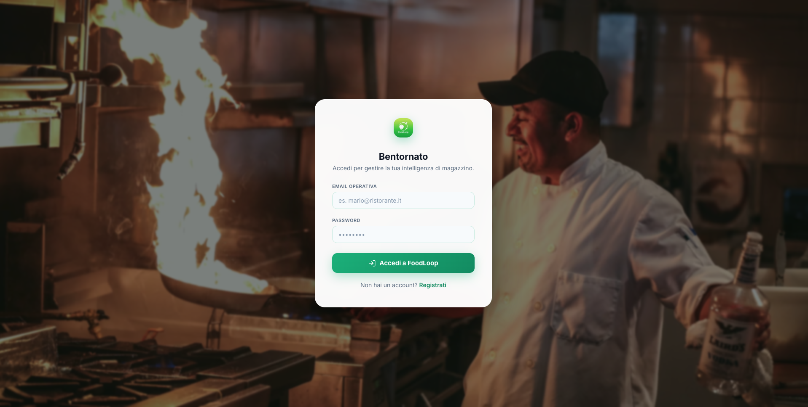
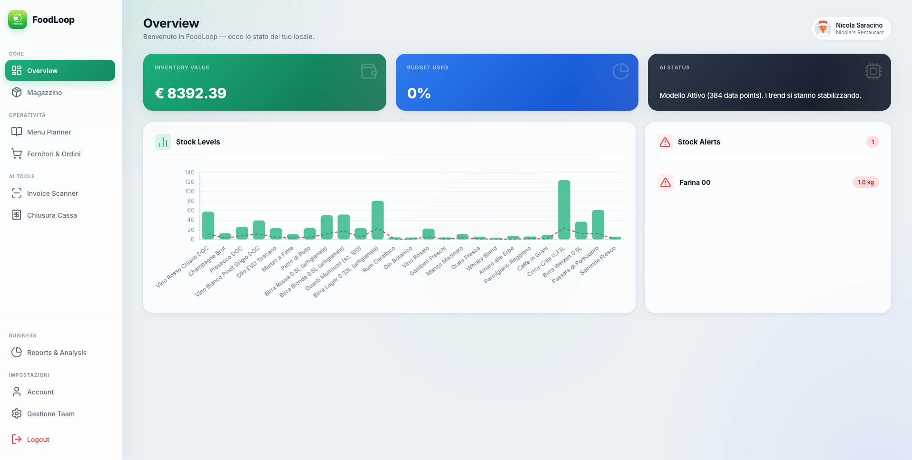

# FoodLoop 🍏 🤖
### *The AI-Powered Sustainable Inventory Partner*

**FoodLoop** è la piattaforma SaaS di nuova generazione progettata per trasformare la gestione della ristorazione da un onere amministrativo a un vantaggio competitivo. Grazie all'integrazione profonda con l'Intelligenza Artificiale, FoodLoop automatizza il magazzino, abbatte gli sprechi e massimizza i profitti.

  

---

## 🌟 L'Innovazione a portata di Click

### 👁️ AI Vision: Dalla Carta al Database in Secondi
Dimentica l'inserimento manuale. Grazie a **Google Gemini AI**, FoodLoop legge fatture e scontrini (anche in formato **HEIC** da iPhone) estraendo automaticamente prodotti, prezzi e quantità. Il sistema è dotato di una logica di **Multi-Model Fallback** (Gemini 2.0 Flash → 2.5 Flash-Lite) per garantire stabilità e velocità in ogni condizione.

### 🧠 Business Intelligence & Forecasting
Non limitarti a guardare il passato. FoodLoop analizza i tuoi dati storici per prevedere i fabbisogni futuri. La sezione **AI Insights** ti avvisa se stai sprecando troppa materia prima o se un fornitore sta alzando i prezzi, agendo come un Direttore Finanziario virtuale.

### 📉 Scarico Intelligente (BOM)
Ogni volta che vendi un piatto, FoodLoop lo "smonta" nei suoi ingredienti di base grazie alla **Distinta Base (Ricette)**. Il sistema gestisce automaticamente la conversione tra unità di acquisto (Kg/L) e unità di consumo (g/ml), garantendo un inventario preciso al grammo.

### 🎨 Design Apple-Style
Un'interfaccia ispirata ai principi del **Glassmorphism**. Pulita, elegante e intuitiva, progettata per essere utilizzata velocemente anche nel caos di una cucina professionale.

---

## 🛠️ Stack Tecnologico d'Avanguardia

* **Core:** Python 3.12 + Flask
* **Intelligenza Artificiale:** Google Gemini API (Generative AI Vision & Forecasting)
* **Data Engine:** SQLAlchemy con supporto Multi-Database (SQLite/PostgreSQL)
* **Frontend:** Jinja2, CSS3 (Custom Glassmorphism Framework), Chart.js per analytics interattive
* **Imaging:** Integrazione `pillow-heif` per supporto nativo formati Apple iOS

---

## 🚀 Evoluzione del Progetto: 42 Fasi di Eccellenza

FoodLoop è il risultato di un percorso di sviluppo rigoroso suddiviso in milestone strategiche:

* **M1: Fondamenta & Auth (Fasi 1-10):** Architettura solida e sicurezza degli accessi.
* **M2: Inventory Engine (Fasi 11-20):** Gestione dinamica delle scorte e logica delle soglie critiche.
* **M3: AI Integration & Vision (Fasi 21-35):** Implementazione dello scanner OCR e gestione intelligente dei documenti.
* **M4: Optimization & Resilience (Fasi 36-40):** Stress test del database (41ms response time), indici di ricerca e ottimizzazione performance.
* **M5: Smart Offloading (Fasi 41-42):** Automazione completa dello scarico magazzino e AI Forecasting.

---

## 🗺️ Verso il Futuro (Roadmap)

- [ ] **Fase 43: Cloud Deployment:** Lancio su Vercel con Database PostgreSQL in Cloud.
- [ ] **Fase 44: Multi-Location:** Supporto per catene di ristoranti e franchising.
- [ ] **Fase 45: Monetizzazione:** Integrazione Stripe per abbonamenti SaaS.
- [ ] **Fase 46: Public Launch:** FoodLoop 1.0 disponibile per il mercato.

---

## 👨‍💻 Sviluppatore
**Nicola** - *Visionary Developer & Entrepreneur*

*"Costruisco tecnologie che permettono alle imprese di respirare, automatizzando ciò che è noioso per lasciare spazio a ciò che è creativo."*